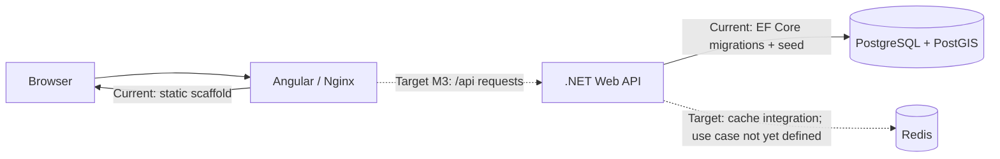

# Architecture

本文件說明 World Line 的工程架構與責任邊界。產品需求與資料模型的決策理由以 [PRD](../.claude/prds/world-line.md) 為準；實作進度以 [implementation plan](../.claude/plans/world-line-implementation-plan.md) 為準。

## Current 與 Target

文件中的架構敘述必須標明狀態：

- **Current**：repository 中已有程式碼，而且能透過目前的啟動方式運作。
- **Target**：已拍板但尚未完成，必須能追溯到 PRD 與 implementation plan 任務。
- **Candidate**：尚未拍板，不得當成既定依賴或驗收條件。

截至 2026-08-27 的系統關係如下：

| Component | Current | Target |
|---|---|---|
| Angular | CLI scaffold 與 smoke tests | MapLibre、時間軸、政權聚焦、事件與多重視角 UI（M3） |
| Nginx | 提供 production static files；`/api/` 反向代理到 backend | 與 `/api/v1` 契約對齊並由 E2E 驗證 |
| .NET API | Controller/OpenAPI scaffold、DbContext、migration、seed | 領域查詢與寫入 API、狀態機、EDTF、API Key（M2） |
| PostGIS | 15 張領域表與示範資料 | 正式史料、查詢索引、I3/I5 應用層約束 |
| Redis | 容器與 connection string 已編排，應用程式未使用 | 只有出現可量測的快取需求後才設計 key、TTL 與失效策略 |

## 執行環境

Docker Compose 包含四個 service：

1. `postgres`：`postgis/postgis:16-3.4`，保存於 named volume。
2. `redis`：Redis 7 Alpine，保存於 named volume。
3. `backend`：.NET 10 runtime，容器內監聽 8080，host 對應 5000。
4. `frontend`：Angular production build + Nginx，容器內監聽 80，host 對應 4200。

Compose 的 backend 使用 `ASPNETCORE_ENVIRONMENT=Development`。因此啟動時會自動執行 migration、加入示範 seed，並公開 `/openapi/v1.json`。這是開發便利設定，不是 production deployment 設計。

## 後端責任邊界

後端是下列規則的唯一信任來源：

- 政權狀態轉換是否合法。
- EDTF 是否有效，以及 `start_decimal`／`end_decimal` 的推算。
- I1-I5 中需要跨資料列或操作流程才能驗證的約束。
- 寫入端點的 API Key 驗證。

前端的 XState 只負責 UI 防呆與呈現，不得取代後端驗證。

資料模型分成三個主要聚合：

- `Regime`：政權、自稱／代稱、疆域快照、年號、持續關係與轉換邊。
- `HistoricalEvent`：客觀事件骨幹、父子事件、標籤、各方視角與爭議點。
- `LineagePreset`：明確標註史觀立場的主線排序，不污染中立的政權轉換圖。

`regime_transition_events` 是 Regime 與 HistoricalEvent 間的跨聚合連結，用來回答「哪個事件促成哪個起源或終止轉換」。

## 時空資料責任

- 政權疆域以 `geometry(MultiPolygon, 4326)` 儲存，時間使用 `int4range`。
- 歷史事件保留 EDTF 字串作為時間真值，decimal year 只供索引與計算。
- 快照之間的視覺形變是呈現層插值，不代表史料證實每個中間時間點的精確邊界。
- 正式資料的來源、授權、精度與修訂規則見 [data governance](data-governance.md)。

## 已知架構缺口

| 缺口 | 影響 | 處理時機 |
|---|---|---|
| 業務 API 尚未實作 | PRD 的 `/api/v1/*` 目前不能呼叫 | M2 |
| Nginx `proxy_pass` 目前會移除 `/api/` prefix | 未來 `/api/v1` route 可能與 backend route 不一致 | 第一個前端 API 串接前修正並測試 |
| 前端 dev server 沒有 API proxy | `npm start` 無法直接使用相對 `/api` 串後端 | M3 開始前 |
| Redis 沒有明確 use case | 額外容器存在但沒有產品價值 | 有效能量測後再決定是否接入或移除 |
| 沒有 production migration/deployment 流程 | Development 自動 migration 不適合直接沿用到正式環境 | 首次部署前 |
| 缺少正式史料的 citation schema | 無法以結構化方式稽核疆域與政權資料來源 | 正式資料匯入前 |

## 變更規則

- 改變業務規則：先更新 constitution，再做 PRD delta review。
- 改變已拍板架構：更新 PRD，必要時新增 ADR，再更新 implementation plan。
- 完成實作：更新 implementation plan、README 現況、OpenAPI 與相關操作文件。
- migration 不得只更新 Entity；PRD schema 與 data governance 受影響時也要同步檢查。
